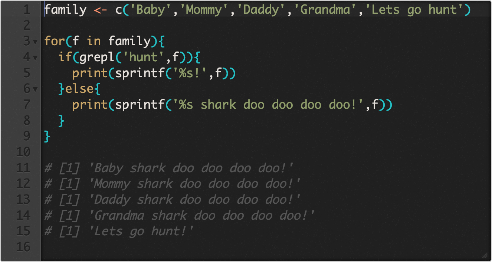

# carbonace

Wanna tweet a screenshot of your code like the pros?


Pretty and crisp as [carbon](https://carbon.now.sh/), but for `R`!

What it is: A shiny app that converts shinyAce as high resolution images to share.

Pluses: 

  - Do not have to be online
  - Do not have to go to a specific site
  - Host locally with your own R installation
  - Seamlessly move from source editor to image

Minuses:

  - shinyAce can manipulate less features than [carbon](https://carbon.now.sh/)

## installation

```r
remotes::install_github('yonicd/carbonace')
```

## How to Run

### Rstudio Addin

Highlight text in source editor and then invoke the carbonace addin.

The highlighted text will be used as the initial value


### Console

```r
library(carbonace)
```

```{r}
carbonace()
```


```r
init <- "createData <- function(rows) {
  data.frame(col1 = 1:rows, col2 = rnorm(rows))
}"

carbonace(init = init)
```


Changing the mode (language)



Changing the theme


