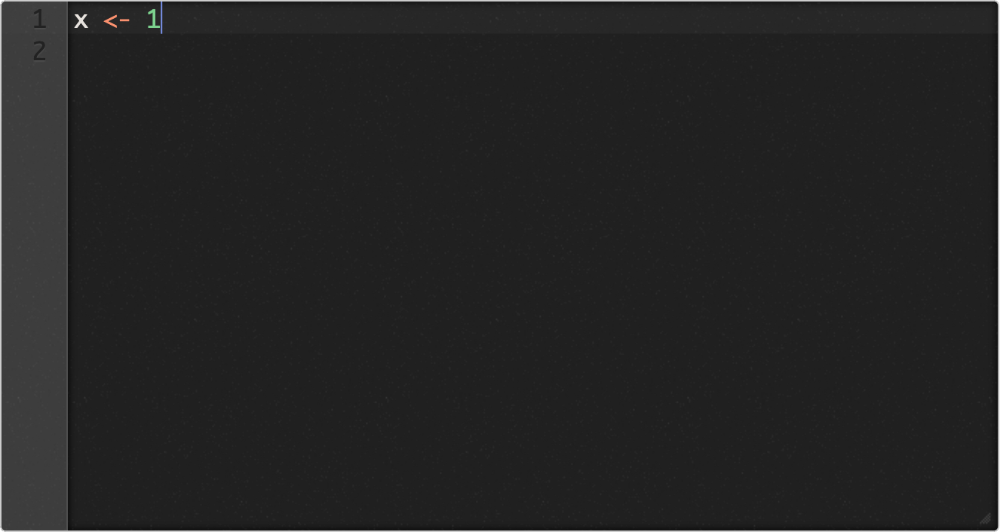

# carbonace

Wanna tweet a pretty screenshot of your code like the pros?


**What it is**: 

A shiny app that converts the ace editor as high resolution images to share that are as pretty and crisp as [carbon](https://carbon.now.sh/), but simplified for `R`!

**Pluses**: 

  - Do not have to be online
  - Do not have to go to a specific site
  - Host locally with your own R installation
  - Seamlessly move from source editor to image

**Minuses**:

  - ace (via [shinyAce](https://github.com/trestletech/shinyAce)) can manipulate less features than [carbon](https://carbon.now.sh/)

## installation

```r
remotes::install_github('yonicd/carbonace')
```

## How to Run

### Rstudio Addin

Highlight text in source editor and then invoke the carbonace addin.

The highlighted text will be used as the initial value


### Console

```r
library(carbonace)
```

```{r}
carbonace()
```



```r
init <- "family <- c('Baby','Mommy','Daddy','Grandma','Lets go hunt')

for(f in family){
  if(grepl('hunt',f)){
    print(sprintf('%s!',f))
  }else{
    print(sprintf('%s shark doo doo doo doo!',f))
  }
}

# [1] 'Baby shark doo doo doo doo!'
# [1] 'Mommy shark doo doo doo doo!'
# [1] 'Daddy shark doo doo doo doo!'
# [1] 'Grandma shark doo doo doo doo!'
# [1] 'Lets go hunt!'"

carbonace(init = init)
```


Changing the mode (language)


Changing the theme


